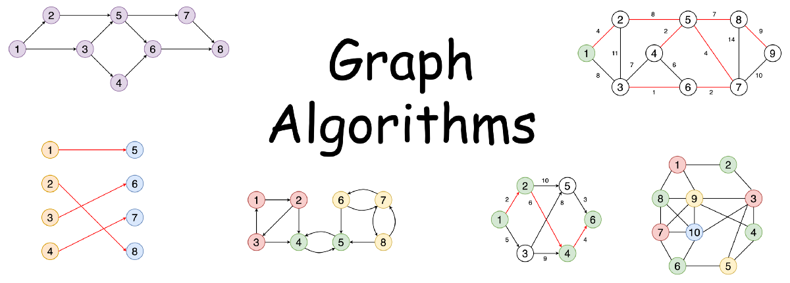

# graph-algorithms-for-competitive-coding
Graph Algorithms Repository for Coding Minutes Course.

This is the repository for Graph Algorithms Course for Competitive Coding.
Created by : Prateek Narang, Apaar Kamal, Coding Minutes

Python version by: [Alisher Alikulov](http://linkedin.com/in/master-alish/)

Checkout the Complete Video Course - 
[Graph Algorithms for Competitive Coding Master Course](https://www.udemy.com/course/graph-theory-algorithms-for-competitive-programming/)

